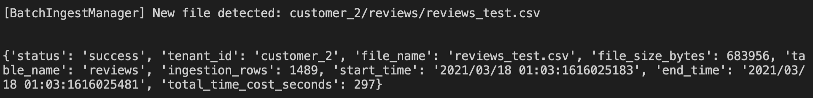

# Assignmeny-2-Report-915014

## Part 1 - Ingestion with batch

### 1. The ingestion will be applied to files of data as data sources. Design a set of constraints for files that mysimbdp will support for ingestion. Design a set of constraints for the tenant service profile w.r.t. ingestion (e.g., number of files, data sizes). Explain why you as a platform provider decide such constraints. Implement these constraints into simple configuration files and provide examples (e.g., JSON or YAML)

* Example of global constraints (json):

    ```json
    {
        "ingestion_type": "batch",
        "valid_file_formats": ["csv"]
    }
    ```

  * valid_file_formats: file formats that mysimbdp support for ingestion, for now only csv file is supported, but it could be extended in the future, so it is an array.

* Example of single tenant's constraints (json)

    ```json
    {
        "tenant_id": "tenant_xxxxx",
        "ingestion_type": "batch",
        "max_columns_per_table": 1000,
        "max_file_size_GB": 1,
        "max_row_size_MB": 5,
    }
    ```

  * tenand_id: namely, tenant's id, which is globally unique, it is needed to organize customers.
  * max_columns_per_table: maximum number of columns per table per tenant.
  * max_file_size_GB: maximum size of a single file to be ingested per tenant.
  * max_row_size: maximum size of a single row to be ingested.

### 2. Each tenant will put its files to be ingested into a directory, client-staging-input-directory within mysimbdp. Each tenant provides ingestion programs/pipelines, clientbatchingestapp, which will take the tenant's files as input, in client-staginginput-directory, and ingest the files into the final sink mysimbdp-coredms. Any clientbatchingestapp must perform at least one type of data wrangling. As a tenant, explain the design of clientbatchingestapp and provide one implementation. Note that clientbatchingestapp follows the guideline of mysimbdp given in the next Point 3

(Note: for this problem, I will explain from the perspective of *customer_1*, not the platform provider.)

First of all, the source code of my **clientbatchingestapp** can be found at [/code/clientingestapps/customer_1/clientbatchingestapp.py](../code/clientingestapps/customer_1/clientbatchingestapp.py), now let's get started!

As a customer, I need to use the client library [/code/clientingesapps/utils/mysimbdp.py](../code/clientingestapps/utils/mysimbdp.py) provided by mysimbdp and follow its rules to write my **clientbatchingestapp**:

1. Firstly, I write my personal config in my ingestapp as following format:

    ```json
    my_config = {
        "tenant_id": "customer_1",
        "tables": [
            {
                "table_name": "listings",
                "primary_key": ["id", "host_id"],
                "schema": [
                    {"field": "id", "type": "BIGINT"},
                    {"field": "listing_url", "type": "TEXT"},
                    {"field": "scrape_id", "type": "BIGINT"},
                    {"field": "last_scraped", "type": "DATE"},
                    {"field": "description", "type": "TEXT"},
                    {"field": "name", "type": "TEXT"},
                    {"field": "picture_url", "type": "TEXT"},
                    {"field": "host_id", "type": "BIGINT"},
                    {"field": "host_url", "type": "TEXT"},
                    {"field": "latitude", "type": "FLOAT"},
                    {"field": "longitude", "type": "FLOAT"},
                    {"field": "property_type", "type": "TEXT"},
                    {"field": "room_type", "type": "TEXT"},
                    {"field": "accommodates", "type": "INT"},
                    {"field": "bathrooms_text", "type": "TEXT"},
                    {"field": "bedrooms", "type": "FLOAT"},
                    {"field": "amenities", "type": "TEXT"},
                    {"field": "price", "type": "TEXT"}
                ]
            }
        ]
    }
    ```

2. Because my **clientbatchingestapp** will be invoked every time I add a new file to **client-staging-input-directory/customer_1/**, so in the main program, I receive *table_name* and *file_name*, and use them to compose a *ingestion_task*:

    ```json
    ingest_task = {
        "table_name": "sample_table",
        "file_name": "a_new_file.csv"
    }
    ```

3. Then I new an instance of class ```MySimBdpClient``` in the platform's client library mentioned above: ```client = MySimBdpClient()```

4. Finally I only need to call the method ```MySimBdpClient.start_batch_ingest_job()``` by passing *my_config* and *ingestion_task* to it, and the ingestion will start: ```result = client.start_batch_ingest_job(my_config, ingest_task)```

(The details about the client library will be discussed in the next question)

### 3. As mysimbdp provider, design and implement a component mysimbdp-batchingestmanager that invokes tenant's clientbatchingestapp to perform the ingestion when files are available in client-staging-input-directory. mysimbdp imposes the model that clientbatchingestapp has to follow. Explain how mysimbdp-batchingestmanager schedules the execution of clientbatchingestapp for tenants

* About mysimbdp-batchingestmanager

    The source code of **mysimbdp-batchingestmanager** can be found at [/code/mysimbdp-batchingestmanager.py](../code/mysimbdp-batchingestmanager.py), in which, the python library *watchdog* is used to listen on the directory **client-stage-input-directory**. If a new file is detected, **mysimbdp-batchingestmanager** will invoke the corresponding customer's **clientbatchingestapp** to perform ingestion.

    The directory **client-staging-input-directory** is under the folder /data of this project, which is designed as following sturcture: ```client-staging-input-directory/<tenant_id>/<table_name>/<file_name.csv>```, so the **mysimbdp-batchingestmanager** can recognize the newly added file belongs to which customer's which table, so that it can invoke the correct customer's ingestion app.

* About the model that clientbatchingestapp has to follow

    Recall the previous question, as the platform provider, I impose a model that customers need to follow when writing their ingest apps, by providing the client library [/code/clientingesapps/utils/mysimbdp.py](../code/clientingestapps/utils/mysimbdp.py).

    When customers develop their **clientbatchingestapp**, they write their *tenant_config* in it and receives *ingest_taks* from *mysimbdp-batchingestmanager*, then they use method ```MySimBdpClient.start_batch_ingest_job(tenant_config, ingest_task)``` to perform ingestion.

    1. ```tenant_config``` contains a customer's *tenant_id* and *metadata of the customer's tables*. *tenant_id* is used to identify customer. *metadata of the customer's tables* is used to dynamically create table and construct cql statements, so that I can achieve multi tenants with different datasets/tables.

    2. ```ingest_task``` contains *file_name* and *table_name*. they are used to locate which file to ingest in **client-staging-input-directory** and which table in Cassandra.

### 4. Explain your design for the multi-tenancy model in mysimbdp: which parts of mysimbdp will be shared for all tenants, which parts will be dedicated for individual tenants so that you as a platform provider can add and remove tenants based on the principle of pay-per-use. Develop test programs (clientbatchingestapp), test data, and test profiles for tenants according your choice of provisioning models. Show the performance of ingestion tests, including failures and exceptions, for at least 2 different tenants in your test environment and constraints

* Multi-tenancy

    In terms of multi-tenancy, commonly there are three kinds of architecture to consider:

  * Multiple Databases (Database-Level Multitenancy)
  * Single Database, Multiple Schemas (Table-Level Multitenancy)
  * A Single, Shared Database Schema (Row-Level Multitenancy)

    I choose the method of Multiple Dayabases, because the advantage of database level isolation is that different tenants are truly independent of each other, that is, system deployment, data storage, access, and data failure recovery are independent, which brings best isolation, data security and scalability. Another advantage of this approach is that it is easier to customize services.

    In this project, Cassandra is used, and the multi-tenancy is implemented through using Tenant IDs as KEYSPACEs. A specific advantages of this is, different replication strategies are available per tenant.

* Test programs

1. Customer_1

    * Source code: [/code/clientingestapps/customer_1/clientbatchingestapp.py](../code/clientingestapps/customer_1/clientbatchingestapp.py)
  
    * Sample of test data: [listings_test.csv](../data/client-staging-input-directory/customer_1/listings/listings_test.csv)

    * Sample of BatchIngestionManager log:
    

    * Sample of daas API request log (flask):
    

    * Sample of customer_1's table in Cassandra:
    

    * Performance of ingestion: 12530.463 bytes/seconds

2. Customer_2

   * Source code: [/code/clientingestapps/customer_2/clientbatchingestapp.py](../code/clientingestapps/customer_2/clientbatchingestapp.py)
  
   * Sample of test data: [reviews_test.csv](../data/client-staging-input-directory/customer_2/reviews/reviews_test.csv)
  
   * Sample of BatchIngestionManager log:
   

   * Sample of daas API request log (flask):
   

   * Sample of customer_2's table in Cassandra:
   

   * Performance of ingestion: 2302.88 bytes/second

### 5. Implement and provide logging features for capturing successful/failed ingestion as well as metrics about ingestion time, data size, etc., for files which have been ingested into mysimbdp. Logging information must be stored in separate files, databases or a monitoring system for analytics of ingestion. Provide and show simple statistical data extracted from logs for individual tenants and for the whole platform with your tests

Logging functionality is implemented in the "client library" [/code/clientingesapps/utils/mysimbdp.py](../code/clientingestapps/utils/mysimbdp.py), it outputs ingestion info into the log file [/logs/batch_ingest_log.log](../logs/batch_ingest_log.log). Log information includes *status, tenant_id, file_name, file_size_bytes, table_name, ingestion_rows, start_time, end_time, total_time_cost in seconds*.

For customer_1: ingested 13720857 bytes of file, and 5054 rows of data in total.

For customer_2: ingested 683956 bytes of file, and 1489 rows of data in total.

For the whole platform: ingested 14404813 bytes of file, 6543 rows of data in total.

## Part 2 - Near-realtime ingestion

### 1. Tenants will put their data into messages and send the messages to a messaging system, mysimbdp-messagingsystem (provisioned by mysimbdp) and tenants will develop ingestion programs, clientstreamingestapp, which read data from the messaging system and ingest data into mysimbdp-coredms. For near-realtime ingestion, explain your design for the multitenancy model in mysimbdp: which parts of the mysimbdp will be shared for all tenants, which parts will be dedicated for individual tenants so that mysimbdp can add and remove tenants based on the principle of pay-per-use. Design and explain a set of constraints for the tenant service profile w.r.t. data ingestion

* Multi-tenancy

    For streaming ingestion and multi-tenancy, RabbitMQ is used in this project. RabbitMQ supports creating virtual servers inside a single RabbitMQ server, which is called virtual hosts (vhost). Each vhost is essentially an independent small RabbitMQ server, with its own independent queue, switch, and binding relationship, in addition, it has its own independent permission. Vhosts provide a logical separation between each instance, allowing to run data safely and confidentially for different programs. It can distinguish between many clients in the same RabbitMQ.

    Thus, in this project, one actual RabbitMQ server is shared for all tenants, but different vhosts are dedicated for individual tenants.

* Constraints
  
    ```json
    {
        "tenant_id": "tenant_xxxxx",
        "ingestion_type": "streaming",
        "max_rows_second_table": 5000,
        "max_row_size_MB": 5,
        "max_http_request_size_MB": 10,
        "max_rows_per_http_request": 200
    }
    ```

  * tenant_id: used to identify tenant.
  * max_rows_second: maximum rows per second per table.
  * max_row_size_MB: maximum size of a single row.
  * max_http_request_size_MB: the streaming ingestion uses http request to insert.
  * max_rows_per_request: maximum rows per request can have.

### 2. Design and implement a component mysimbdp-streamingestmanager, which invokes on-demand clientstreamingestapp (e.g., start, stop). mysimbdp imposes the model that clientstreamingestapp has to follow, explain the model

* About mysimbdp-streamingestmanager

    Source code of **mysimbdp-streamingestmanager** can be found at [/code/mysimbdp-streamingestmanager.py](../code/mysimbdp-streamingestmanager.py)

    As stated in the previous question, every tenant has a dedicated RabbitMQ vhost, so **mysimbdp-streamingestmanager** starts different threads to consume messages from RabbitMQ, every thread connects one RabbitMQ vhost, the vhost name represents *tenant_id*. Then, in every tenant's dedicated vhost, a queue is bound to a exchange using routing_key named by *table_name*.

    Now, we have vhost_name=tenant_id, routing_key=table_name, so **mysimbdp-streamingestmanager** can identify the message it receives belongs to which tenant's which table, it will invoke corredsponding **clinetstreamingestapp** to ingest data when it receives a message from RabbitMQ.

* About the model that clientstreamingestapp has to follow

    Same as batch ingestion part, I impose a model that customers need to follow by providing the client library [/code/clientingesapps/utils/mysimbdp.py](../code/clientingestapps/utils/mysimbdp.py).

    When customers develop their **clientstreamingestapp**, they write their *tenant_config* in it and receives *ingest_taks* from *mysimbdp-streamingestmanager*, then they use method ```MySimBdpClient.start_stream_ingest_job(tenant_config, ingest_task)``` to perform ingestion.

    1. ```tenant_config``` contains a customer's *tenant_id* and *metadata of the customer's tables*. *tenant_id* is used to identify customer. *metadata of the customer's tables* is used to dynamically create table and construct cql statements, so that I can achieve multi tenants with different datasets/tables.

    2. ```ingest_task``` contains *table_name* and *data*, in which, *data* is the json data to be ingested.

### 3. Develop test ingestion programs (clientstreamingestapp), test data, and test profiles for tenants. Show the performance of ingestion tests, including failures and exceptions, for at least 2 different tenants in your test environment

1. Customer_1

    * Source code: [/code/clientingestapps/customer_1/clientstreamingestapp.py](../code/clientingestapps/customer_1/clientstreamingestapp.py)

    * Sample of test data: [listings_test.csv](../data/client-staging-input-directory/customer_1/listings/listings_test.csv)

    * Sample of StreamIngestionManager log:
    

    * Sample of daas API request log (flask):
    

    * Log file: [/logs/stream_ingest_log_customer_1.log](../logs/stream_ingest_log_customer_1.log), performance can be found in the end of every row 'total_time_cost_second'

2. Customer_2

   * Source code: [/code/clientingestapps/customer_2/clientstreamingestapp.py](../code/clientingestapps/customer_2/clientstreamingestapp.py)

   * Sample of test data: [reviews_test.csv](../data/client-staging-input-directory/customer_2/reviews/reviews_test.csv)

   * Sample of StreamIngestionManager log:
   

   * Sample of daas API request log (flask):
   

   * Log file: [/logs/stream_ingest_log_customer_2.log](../logs/stream_ingest_log_customer_2.log), performance can be found in the end of every row 'total_time_cost_second'

### 4. clientstreamingestapp decides to report the its processing rate, including average ingestion time, total ingestion data size, and number of messages to mysimbdp-streamingestmonitor within a pre-defined period of time. Design the report format and explain possible components, flows and the mechanism for reporting

In my design, **clientstreamingestapp** is only invoked when **mysimbdp-streamingestmanager** receives message from MQ, while **mysimbdp-streamingestmanager** is running in the background and directly consumes MQ, so the reporting functionality can be added to the **mysimbdp-streamingestmanager**. First, when **mysimbdp-streamingestmanager** receives a message, row size can be calculated from message body. Then it invokes a **clientstreamingestapp** to perform the ingestion. We know **clientstreamingestapp** actually use my "library API" to perform the ingestion, from which it will receives a report of ingestion situation, including start_time, end_time, successful or failed. So now we only require **clientstreamingestapp** to send those reports back to **mysimbdp-streamingestmanager**.

Log format will be like following, in csv file:

```tenant_id, message_body_size, start_time, end_time, status```

Thus, we can calculate processing rate, total ingestion data size and number of messages from logs.

### 5. Implement the feature in mysimbdp-streamingestmonitor to receive the report from clientstreamingestapp. Based on the report from clientstreamingestapp and the tenant profile, when the performance is below a threshold, e.g., average ingestion time is too low, or too many messages have to be processed, mysimbdp-streamingestmonitor decides to inform mysimbdp-streamingestmanager about the situation (e.g., mysimbdp-streamingestmanager may create more instances of clientstreamingestapp for the tenant or remove existing instances). Implementation the integration between mysimbdpstreamingestmonitor and mysimbdp-streamingestmanager

## Part 3 - Integration and Extension